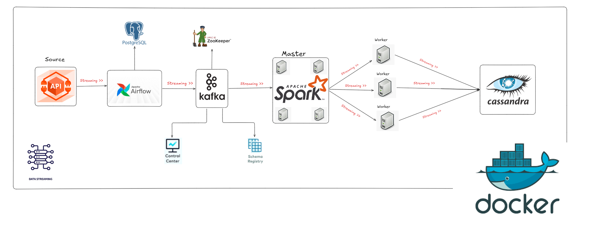

# Realtime_Data_Streaming

## Overview

This project demonstrates a scalable real-time data engineering pipeline using modern big data technologies.

The pipeline collects live user data from an external API, streams it through Apache Kafka, processes it using Apache Spark Structured Streaming, and stores the transformed data in Cassandra.

Apache Airflow is used for orchestration, while Docker is used to containerize the entire infrastructure.

## Technologies Used

* Apache Airflow
* Apache Kafka
* Apache Spark
* Apache Cassandra
* PostgreSQL
* Docker
* Python

## Architecture

API → Airflow → Kafka → Spark → Cassandra

## Author

Mohamed Abo Nema
